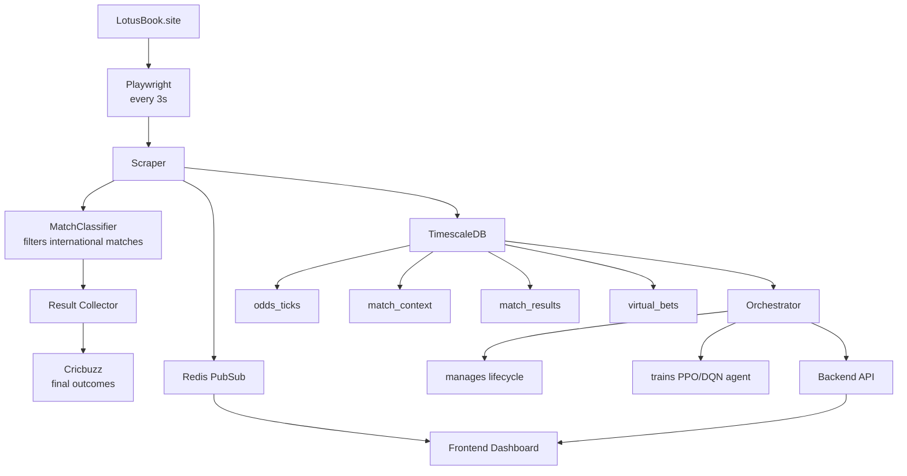
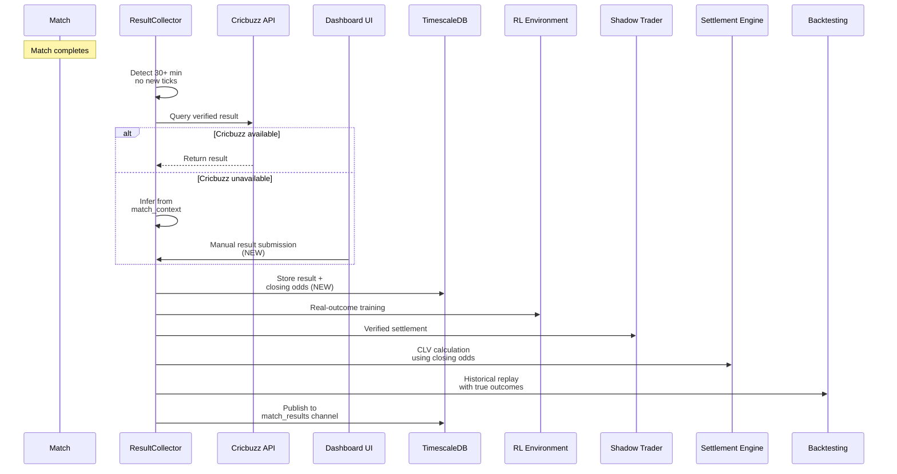

# PHOENIX Admin Guide

## Architecture Overview



---

## CLI Reference

All management is done through `phoenix.ps1`:

| Command | Description |
|---------|-------------|
| `.\phoenix.ps1 start` | Start all services |
| `.\phoenix.ps1 start -InfraOnly` | Start only Redis + TimescaleDB |
| `.\phoenix.ps1 start -Dev` | Include PgAdmin + Redis Commander |
| `.\phoenix.ps1 stop` | Stop all services |
| `.\phoenix.ps1 stop -KeepInfra` | Stop apps but keep DB running |
| `.\phoenix.ps1 status` | Health check all services |
| `.\phoenix.ps1 logs` | Recent logs from all services |
| `.\phoenix.ps1 logs -Service scraper` | Logs for a specific service |
| `.\phoenix.ps1 restart -Service backend` | Restart a specific service |
| `.\phoenix.ps1 test` | Run all test suites |
| `.\phoenix.ps1 test -Suite unit` | Run only unit tests |
| `.\phoenix.ps1 db-init` | Initialize database schema |
| `.\phoenix.ps1 orch` | Show orchestrator lifecycle state |
| `.\phoenix.ps1 backup` | Backup TimescaleDB to file |
| `.\phoenix.ps1 restore` | Restore from latest backup |
| `.\phoenix.ps1 open` | Open dashboard in browser |

---

## API Endpoints

| Method | Endpoint | Description |
|--------|----------|-------------|
| GET | `/api/health` | System health |
| GET | `/api/matches/active` | Live matches |
| GET | `/api/matches/odds/{id}` | Odds history |
| GET | `/api/training/metrics` | Training metrics |
| GET | `/api/training/summary` | Training summary |
| GET | `/api/agent/state` | Agent state |
| GET | `/api/agent/bets` | Virtual bet history |
| GET | `/api/agent/performance` | Performance summary |
| GET | `/api/graduation/status` | Graduation progress |
| GET | `/api/advisor/state` | Orchestrator state |
| GET | `/api/advisor/stats` | Orchestrator stats |
| GET | `/api/advisor/signals` | Bet signals |
| GET | `/api/advisor/shadow/performance` | Shadow trading metrics |
| GET | `/api/advisor/shadow/drift` | Drift detection status |
| POST | `/api/advisor/demote` | Manually demote agent |
| GET | `/api/matches/training-status` | List all matches with training status |
| GET | `/api/matches/{id}/validate` | Run data quality validation on a match |
| PATCH | `/api/matches/{id}/approve` | Approve match for training (runs validation first) |
| PATCH | `/api/matches/{id}/reject` | Reject match from training |
| DELETE | `/api/matches/{id}` | Delete rejected match and all its data |
| POST | `/api/matches/{id}/result` | **NEW:** Submit manual match result (fallback when Cricbuzz fails) |
| GET | `/api/matches/{id}/closing_odds` | **NEW:** Get closing odds for CLV calculation |
| PATCH | `/api/matches/{id}/approve-scrape` | Approve match for scraping |
| PATCH | `/api/matches/{id}/reject-scrape` | Reject match from scraping |
| GET | `/api/training/data-quality` | Episode quality gate report for all matches |
| POST | `/api/agent/settle-pending` | Retroactively settle pending bets with match results |
| GET | `/api/matches/context/{id}` | Match context history |
| GET | `/api/training/steps` | Current training progress |

---

## Configuration

All configuration is in `shared/config.py` with environment variable overrides.

### Key Settings

| Setting | Env Var | Default | Description |
|---------|---------|---------|-------------|
| DB Password | `POSTGRES_PASSWORD` | - | Set in `.env` |
| Scraper URL | `SCRAPER_BETTING_SITE_URL` | lotusbook.site/cricket | Target site |
| International Only | `SCRAPER_INTERNATIONAL_ONLY` | true | Filter for ICC + major franchise matches |
| Poll Interval | `SCRAPER_POLL_INTERVAL` | 3 seconds | Scraping frequency |
| Auto-approve Matches | `SCRAPER_AUTO_APPROVE_MATCHES` | false | If false, all matches require manual approval on /matches |
| RL Algorithm | `RL_ALGORITHM` | ppo | ppo or dqn |
| Training Steps | `RL_TOTAL_TIMESTEPS` | 500,000 | Initial training steps |
| Min Matches | `RL_MIN_MATCHES_TO_TRAIN` | 10 | Required before training |
| Starting Bankroll | `RL_STARTING_BANKROLL` | 100,000 | Virtual bankroll |

### Betting & Anti-Detection Constants (`shared/constants.py`)

| Constant | Value | Description |
|----------|-------|-------------|
| `PER_MATCH_BUDGET` | 1,00,000 | Default budget per match |
| `PAYOUT_HEADROOM_FACTOR` | 1.5 | Budget extends by 1.5× potential payouts |
| `MAX_BETS_PER_MATCH` | 20 | Reasonable limit per match (prevents runaway betting) |
| `MIN_BET_INTERVAL_SECONDS` | 15 | Baseline cooldown between bets on same match |
| Stake Percent (RL env) | SM=1%, LG=3% of bankroll | During RL training episodes |
| Stake Percent (Live) | SM=10%, LG=25% of per-match budget | During virtual/live trading |
| `STAKE_ROUND_BUCKETS` | [50..5000] | Human-like stake rounding amounts |
| `STAKE_NOISE_PERCENT` | 0.20 | +/-20% random noise on stakes |
| `BET_DELAY_MIN_SECONDS` | 5 | Min random delay before bet placement |
| `BET_DELAY_MAX_SECONDS` | 15 | Max random delay before bet placement |

### Graduation Criteria

All must be met for 14 consecutive days:

| Criterion | Threshold | Window |
|-----------|-----------|--------|
| Win Rate | >= 55% | Last 200 bets |
| ROI | >= 8% | Last 200 bets |
| Sharpe Ratio | >= 1.5 | Last 30 days |
| Max Drawdown | <= 15% | Last 30 days |
| Profitable Days | >= 10 | Last 14 days |
| Bet Volume | >= 100 | Last 30 days |
| Average CLV | > 0 | Last 200 bets |

### Drift Detection (Post-Graduation)

| Threshold | Value | Action |
|-----------|-------|--------|
| Win Rate Floor | 50% | Warning |
| ROI Floor | -2% | Warning |
| Sharpe Floor | 0.50 | Warning |
| Max Drawdown | 20% | Warning |
| Consecutive Drift Days | 5 | Auto-demotion |

---

## Match Result Pipeline



---

## Backtesting

Run backtests via the `backtesting/` module:

```python
from backtesting.backtester import Backtester
bt = Backtester(model_path="models/best_model.zip")
results = bt.compare_strategies(episodes)
# Returns: {"agent": {...}, "hold": {...}, "random": {...}, "momentum": {...}}
```

Statistical significance is computed via bootstrap 95% CI on Sharpe ratio and mean P&L.

---

## Database Backup

```powershell
# Create backup
.\phoenix.ps1 backup

# Restore from latest
.\phoenix.ps1 restore

# Restore from specific file
.\phoenix.ps1 restore -Service "backups\phoenix_backup_20260207.sql"
```

Backups are stored in the `backups/` directory (auto-cleaned to last 10).

---

## Troubleshooting

| Problem | Solution |
|---------|----------|
| Backend won't start (port 8001 in use) | Kill stale process: `Get-NetTCPConnection -LocalPort 8001 | Stop-Process` |
| Scraper failing | Check LotusBook is accessible. Run `.\phoenix.ps1 logs -Service scraper` |
| Agent stuck in ACCUMULATING | Check scraper is running and collecting matches. Need 10+ with 50+ ticks |
| Agent demoted after graduation | Performance drift detected. Check shadow trading metrics on Advisor page |
| No match results being collected | Check `.\phoenix.ps1 logs -Service scraper` for result_collector errors |
| Database connection issues | Verify `POSTGRES_PASSWORD` in `.env` matches Docker Compose |
