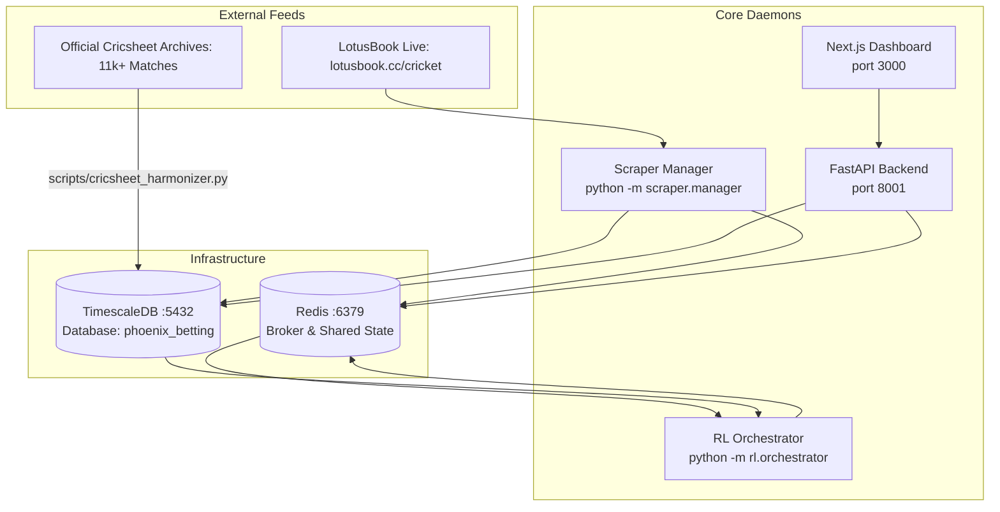

# PHOENIX Admin & Operations Guide

## Overview

This guide provides system administrators and quant engineers with full operational documentation for running, monitoring, tuning, and maintaining the PHOENIX cricket prediction and two-way rate trading platform.

---

## 1. System Architecture & Topology


```mermaid
flowchart TD
    subgraph "External Feeds"
        A[LotusBook Live: lotusbook.cc/cricket]
        B[Official Cricsheet Archives: 11k+ Matches]
    end

    subgraph "Core Daemons"
        C[Scraper Manager<br/>python -m scraper.manager]
        D[RL Orchestrator<br/>python -m rl.orchestrator]
        E[FastAPI Backend<br/>port 8001]
        F[Next.js Dashboard<br/>port 3000]
    end

    subgraph "Infrastructure"
        G[(TimescaleDB :5432<br/>Database: phoenix_betting)]
        H[(Redis :6379<br/>Broker & Shared State)]
    end

    A --> C
    B -->|scripts/cricsheet_harmonizer.py| G
    C --> H
    C --> G
    H --> D
    G --> D
    D --> H
    E --> G
    E --> H
    F --> E
```

---

## 2. Infrastructure & Credentials

| Component | Default Host & Port | Credentials / Target | Notes |
|---|---|---|---|
| **TimescaleDB** | `localhost:5432` | `user=phoenix`<br/>`password=phoenix_secure_2026`<br/>`database=phoenix_betting` | Hypertable partitioned time-series storage. |
| **Redis** | `localhost:6379` | `db=0` (no auth by default) | Pub/Sub message broker & real-time state. |
| **Backend API** | `localhost:8001` | — | FastAPI application gateway (`backend.main:app`). |
| **Frontend UI** | `localhost:3000` | — | Next.js 14 reactive dashboard. |
| **Target Bookmaker** | Web | `https://lotusbook.cc/cricket` | CDP WebSocket interception + DOM polling. |

---

## 3. PowerShell CLI (`phoenix.ps1`) Reference

All operational tasks can be managed using the root PowerShell harness:

| Command | Description |
|---|---|
| `.\phoenix.ps1 start` | Start all infrastructure and application daemons. |
| `.\phoenix.ps1 start -InfraOnly` | Start only TimescaleDB and Redis containers. |
| `.\phoenix.ps1 start -Dev` | Start services with developer UI tools (pgAdmin, Redis Commander). |
| `.\phoenix.ps1 stop` | Gracefully shut down all background processes and containers. |
| `.\phoenix.ps1 stop -KeepInfra` | Stop application processes while keeping TimescaleDB and Redis running. |
| `.\phoenix.ps1 status` | Health check all services, ports, and background tasks. |
| `.\phoenix.ps1 logs` | Aggregate tail of recent logs across all running components. |
| `.\phoenix.ps1 logs -Service scraper` | Tail logs specifically for the Scraper Manager. |
| `.\phoenix.ps1 orch` | Print current RL Orchestrator lifecycle state from Redis. |
| `.\phoenix.ps1 db-init` | Run database schema initialization and migrations. |
| `.\phoenix.ps1 backup` | Dump `phoenix_betting` database to a timestamped `.sql` archive. |
| `.\phoenix.ps1 restore` | Restore database from the most recent backup archive. |

---

## 4. Key Configuration Parameters (`shared/config.py` & `.env`)

| Parameter | Environment Variable | Default Value | Description |
|---|---|---|---|
| **Per-Match Budget** | `PER_MATCH_BUDGET` | `100_000` | Hard capital commitment per match ($100k / ₹1,00,000). |
| **Max Bets Per Match** | `MAX_BETS_PER_MATCH` | `30` | Maximum trades executed per match (target: 20–30). |
| **Max Bets Per Hour** | `MAX_BETS_PER_HOUR` | `30` | Rate-limiting ceiling to prevent high-frequency churn. |
| **Small Stake %** | `SMALL_STAKE_PERCENT`| `0.02` | Small bet stake: 2% of budget ($2,000). |
| **Large Stake %** | `LARGE_STAKE_PERCENT`| `0.04` | Large bet stake: 4% of budget ($4,000). |
| **Observation Size** | `OBSERVATION_SIZE` | `50` | Exact feature vector dimension. |
| **Scraper Target URL**| `SCRAPER_BETTING_SITE_URL` | `https://lotusbook.cc/cricket` | Live exchange scraping target. |
| **Min Quality Score** | `DATA_QUALITY_MIN_SCORE` | `0.70` | Threshold for approving matches into training. |
| **Model Checkpoint** | `RL_MODEL_PATH` | `models/best_model.zip` | Production model weights path. |

---

## 5. REST API Endpoint Reference (Backend Gateway `:8001`)

### Health & System Status
- `GET /api/health` — Checks database, Redis, and worker connectivity.
- `GET /api/advisor/state` — Returns current RL Orchestrator lifecycle state.
- `GET /api/advisor/stats` — Returns match accumulation and training statistics.

### Matches & Data Validation
- `GET /api/matches/active` — Lists all currently live cricket matches.
- `GET /api/matches/training-status` — Lists all matches with two-phase scrape/training status.
- `GET /api/matches/{id}/validate` — Executes `EpisodeQualityGate` validation and returns a diagnostic report.
- `PATCH /api/matches/{id}/approve` — Approves a match for RL training (validates automatically).
- `PATCH /api/matches/{id}/reject` — Rejects a match from training.
- `POST /api/matches/{id}/result` — Manually submits a match result (winner, margin, result type).
- `GET /api/matches/{id}/closing_odds` — Retrieves closing odds and calculates Closing Line Value (CLV).

### Virtual Trading & RL Performance
- `GET /api/agent/bets` — Retrieves historical virtual trades from `virtual_bets`.
- `GET /api/agent/performance` — Returns aggregate P&L, win rate, Sharpe ratio, and profit factor.
- `GET /api/training/metrics` — Returns episodic training curves (reward, loss, entropy).
- `GET /api/graduation/status` — Returns rolling 14-day graduation evaluation status.
- `GET /api/advisor/signals` — Broadcasts real-time trading recommendations for human execution.
- `POST /api/advisor/demote` — Manually demotes agent back to `VIRTUAL_TRADING` for retraining.

---

## 6. Manual Ingestion & Model Training Runbook

### Re-Harmonizing Historical Matches
To re-process raw Cricsheet JSON files into the database:
```powershell
$env:PYTHONPATH = "c:\Users\sohai\Downloads\prediction-claude"
$env:PYTHONHOME = "C:\Users\sohai\AppData\Local\Programs\Python\Python313"
& "C:\Python313\python.exe" scripts/cricsheet_harmonizer.py
```

### Running Offline Two-Way Rate Trading Benchmark
To run the full evaluation benchmark across unseen matches:
```powershell
$env:PYTHONPATH = "c:\Users\sohai\Downloads\prediction-claude"
$env:PYTHONHOME = "C:\Users\sohai\AppData\Local\Programs\Python\Python313"
& "C:\Python313\python.exe" scripts/iterative_tuning_and_virtual_testing.py
```
