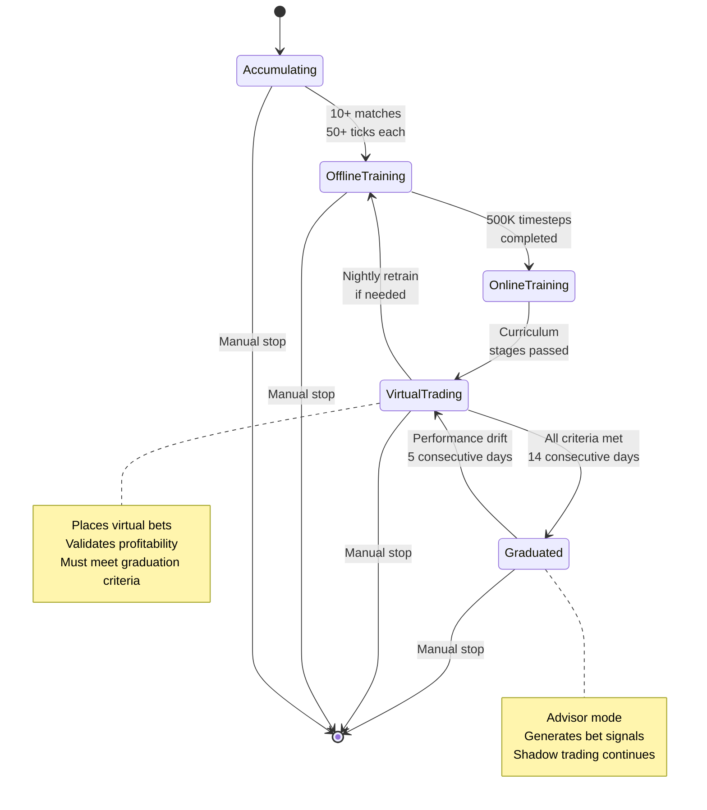

# PHOENIX User Guide

## What is PHOENIX?

PHOENIX is an automated cricket betting analysis system that uses Reinforcement Learning (RL) to identify profitable betting opportunities. It scrapes live odds from LotusBook, trains an AI agent through virtual betting, and after proving consistent profitability, graduates to advisor mode where it recommends bets for you to place manually.

**Important:** PHOENIX never places real bets automatically. After graduation, it suggests bets with confidence scores. You decide whether to act on them.

---

## Dashboard Pages

```mermaid
graph TB
    subgraph "Main Dashboard"
        A[localhost:3000]
        A1[Health Status Bar]
        A2[Training Progress]
        A3[Virtual Trading]
        A4[System Status]
    end
    
    subgraph "Training Monitor"
        B[/training]
        B1[Summary Cards]
        B2[Episode Charts]
        B3[Win Rate Trend]
    end
    
    subgraph "Virtual Trading"
        C[/trading]
        C1[Performance Cards]
        C2[Bet History Table]
    end
    
    subgraph "Graduation Progress"
        D[/graduation]
        D1[Progress Bar]
        D2[Criteria Cards]
        D3[Pass/Fail Status]
    end
    
    subgraph "Live Matches"
        E[/matches]
        E1[Step 1: Scrape Approval]
        E2[Step 2: Training Approval]
        E3[Data Validation]
        E4[Manual Result Entry]
    end
    
    subgraph "Advisor"
        F[/advisor]
        F1[Lifecycle State]
        F2[Drift Warning]
        F3[Shadow Trading]
        F4[Live Signals]
        F5[Manual Demotion]
    end
    
    A --> B
    A --> C
    A --> D
    A --> E
    A --> F
```

---

## Agent Lifecycle



---

## Reading Bet Signals

When the agent is graduated, the Advisor page shows signals like:

- **Action:** BACK_HOME_SM (back home team, small stake) or LAY_AWAY_LG (lay away team, large stake)
- **Confidence:** How certain the agent is (e.g., 72%)
- **Action Probabilities:** Full distribution across all 9 actions

**Per-Match Budget:** Each match has a default budget of ₹1,00,000. SM actions use ~10% (₹10,000), LG actions use ~25% (₹25,000) of the per-match budget during live/virtual trading. Stakes are rounded to human-like amounts (100, 500, 1000, etc.) with ±20% noise for anti-detection.

> **Note:** During RL training, stake sizes are 1% (SM) / 3% (LG) of the agent's bankroll — different from live trading which uses the per-match budget.

**Multi-Account Strategy:** Distribute each recommendation to a different account. One account may profit, another may lose, but the portfolio stays net positive. This avoids bookmaker flagging.

**Guidelines:**
- Only act on signals with confidence > 50%
- Start with small stakes (SM actions) until you trust the system
- Place hedging bets on both sides to lock in profit during volatile moments
- The agent may recommend up to 20 bets per match (`MAX_BETS_PER_MATCH`), with a 15-second minimum cooldown between bets

---

## FAQ

**Q: How long until the agent graduates?**
A: Depends on match availability. With 2-3 international matches per day, expect 2-4 weeks for data accumulation, 1-2 days for training, and 2-3 weeks for virtual trading validation.

**Q: What if the agent keeps failing graduation?**
A: The orchestrator automatically retrains nightly. If criteria are not met after extended periods, consider adjusting the configuration (lower thresholds or more training steps).

**Q: Does the agent bet real money?**
A: Never. PHOENIX only recommends bets. You must place them manually on LotusBook.

**Q: How should I approve matches for training?**
A: Go to /matches, click **Validate** on each match to see the quality report. Only approve matches with quality score > 85% and sufficient live ticks (30+). The system will block approval if quality is below 50%.

**Q: What is CLV?**
A: Closing Line Value measures if you got better odds than the market's final price. Positive CLV is the strongest indicator of genuine betting skill. PHOENIX now captures closing odds automatically for accurate CLV calculation.

**Q: What if Cricbuzz doesn't have the match result?**
A: Use the **📝 Result** button on the /matches page to submit the result manually. Select the winner, result type (win/tie/draw/no_result/abandoned), and optionally the margin.

**Q: How many accounts do I need?**
A: At least 3-5 accounts for distributing bets. Each recommendation goes to a different account so no single account shows consistently high win rates.
