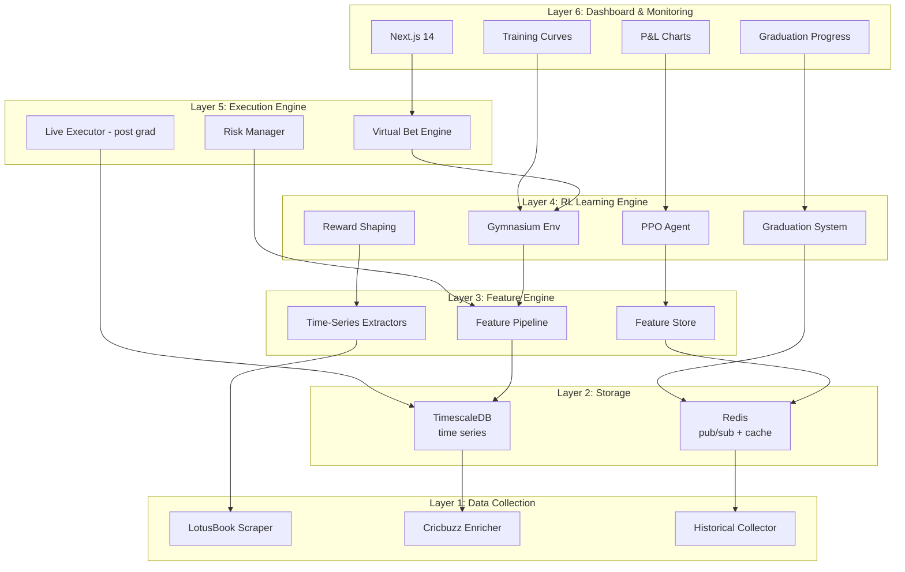
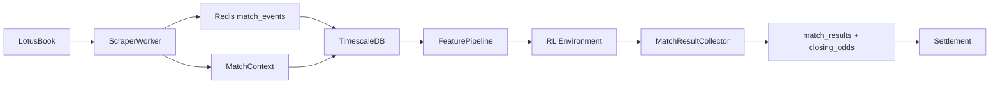
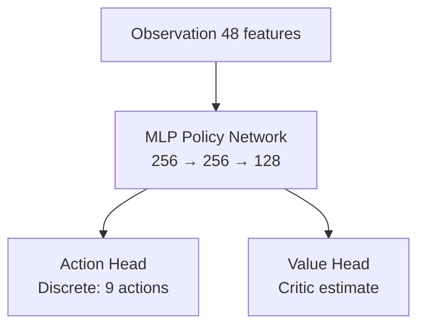
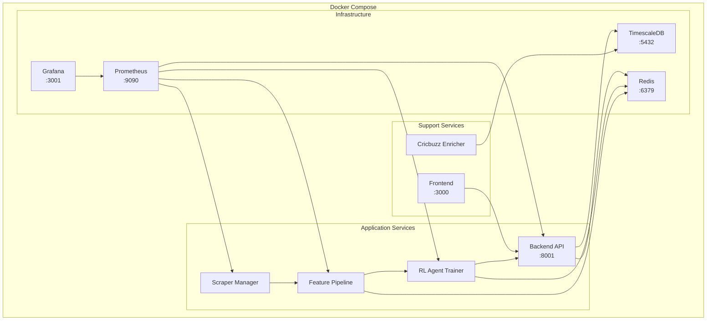
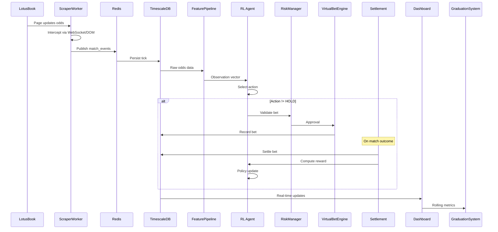

# PHOENIX System Architecture

## Overview

PHOENIX is a reinforcement learning-based cricket betting intelligence system that learns to make consistent profits from live cricket odds on LotusBook. Unlike traditional rule-based betting systems, PHOENIX uses an RL agent that improves through experience -- placing virtual bets, observing outcomes, and refining its policy over time.

**Core Principle:** The system does NOT go live until the RL agent proves consistent profitability in virtual trading.

---

## Architecture Layers



---

## Layer 1: Data Collection

### LotusBook Scraper

Target: `https://lotusbook.site/cricket`

**Site Structure Observed:**
- Cricket matches listed with team names
- 1X2 format (Home / Draw / Away) for pre-match
- Back and Lay prices displayed
- Live matches with real-time odds updates
- Upcoming events with scheduled times
- Markets: ICC T20 World Cup, Women's Premier League, domestic leagues

**Data Points to Capture:**

| Field | Type | Source | Priority |
|-------|------|--------|----------|
| match_id | string | Generated | Critical |
| team_home | string | DOM | Critical |
| team_away | string | DOM | Critical |
| back_price_home | float | DOM/WS | Critical |
| lay_price_home | float | DOM/WS | Critical |
| back_price_away | float | DOM/WS | Critical |
| lay_price_away | float | DOM/WS | Critical |
| back_price_draw | float | DOM/WS | High |
| lay_price_draw | float | DOM/WS | High |
| is_live | bool | DOM | Critical |
| competition | string | DOM | High |
| match_time | datetime | DOM | High |
| timestamp | datetime | System | Critical |

**Scraping Strategy:**
1. Primary: WebSocket interception via CDP for real-time odds
2. Fallback: DOM scraping every 3-5 seconds
3. Session management: Login handling, cookie persistence
4. Anti-detection: Random delays, human-like mouse movement, viewport randomization

### Match Context (from Scraper)

Match context is now extracted inline from the scraper's score_text parsing:
- Live score, wickets, overs
- Run rate, required run rate
- Innings, batting/bowling teams
- Match phase detection (powerplay/middle/death)

### Match Result Collector

Collects final match outcomes for RL settlement:
- Primary: Cricbuzz API query
- Fallback 1: Inference from match_context data
- Fallback 2: Manual submission via API/UI
- **Closing Odds Capture:** Stores last tick odds for CLV calculation

### Data Flow



---

## Layer 2: Storage

### TimescaleDB

**Hypertables (time-series optimized):**

1. `odds_ticks` - Raw odds time series
   - Partitioned by time (1-hour chunks)
   - Indexed on (match_id, time DESC)
   - Retention: 90 days high-res, compressed after 7 days

2. `match_context` - Match context snapshots
   - Score, wickets, overs, run rate, req_run_rate, innings
   - Derived from LotusBook score_text by LiveMatchTracker

3. `virtual_bets` - All virtual bet records
   - Action (BettingAction enum), team, stake, odds, outcome, P&L
   - Closing odds + CLV fields for post-settlement analysis
   - Feeds RL reward computation

4. `training_metrics` - RL training progress
   - Episode reward, win rate, ROI, Sharpe, losses, entropy
   - Agent version tracking

5. `graduation_snapshots` - Rolling graduation metrics
   - Win rate, ROI, Sharpe ratio, max drawdown, profitable days
   - `all_criteria_met` flag, consecutive qualifying days

6. `match_results` - Final match outcomes
   - Winner, loser, result_type, margin
   - Closing odds for CLV calculation
   - Source: lotusbook_odds, cricbuzz, manual

7. `match_training_status` - Two-phase approval tracking
   - scrape_status: discovered / scrape_approved / scrape_rejected
   - training_status: pending / approved / rejected

### Redis

**Pub/Sub Channels:**
- `match_events` - Real-time odds from scraper
- `match_context` - Cricket stats from LiveMatchTracker
- `rl_actions` - Agent decisions (bet/hold)
- `virtual_outcomes` - Bet settlement events
- `training_progress` - Training metrics for dashboard
- `match_results` - Match result announcements
- `advisor_signals` - Real-time advisor signals (post-graduation)

**Key-Value Store:**
- `active_matches` - Currently live matches (JSON)
- `agent:state` - Current RL agent mode
- `agent:version` - Current model version
- `feature_cache:{match_id}` - Cached feature vector per match
- `match_context:{match_id}` - Latest match context (TTL 60s)
- `graduation:status` - Current graduation progress
- `orchestrator:state` - Lifecycle state (authoritative source of truth)
- `orchestrator:stats` - Accumulation / training stats
- `advisor:signals` - Current bet suggestions
- `shadow:performance` - Shadow trader post-graduation performance
- `shadow:drift` - Drift detection status
- `demo:watched_match_id` - User-selected match for watch mode

---

## Layer 3: Feature Engine

The Feature Engine transforms raw odds and match data into the observation space for the RL agent.

### Feature Categories (48-dim observation vector)

Every feature maps to something a professional cricket bettor monitors. No noise, no redundancy.

| Group | Dim | Features |
|-------|-----|----------|
| 1. Core Odds | 7 | back/lay home & away, margin, spreads |
| 2. Momentum | 6 | velocity, volatility, trend (zeroed on gap) |
| 3. Market Quality | 5 | spread dynamics, efficiency, staleness |
| 4. Match State | 7 | is_live, overs, wickets, score, run_rate, req_rr, innings |
| 5. Portfolio | 5 | bankroll %, exposure, positions, win rate, streak |
| 6. Position | 4 | net exposure home/away, hedge potential |
| 7. Volume | 4 | liquidity depth, imbalance |
| 8. Bookmaker | 4 | pricing patterns the agent learns to read |
| 9. Format | 4 | T20i / ODI / Test / Franchise one-hot |
| 10. Timing | 2 | match elapsed %, tick freshness |

### Feature Pipeline

```python
class FeaturePipeline:
    """
    Computes RL observation vector from raw data. DATA-ONLY approach.
    Input: match_id + OddsEvent + MatchContext + PortfolioState + position_state
    Output: np.ndarray of shape (48,)
    """
    def compute(self, match_id, event, context=None, portfolio=None, position_state=None):
        features = []
        features.extend(compute_odds_features(event))            # 7
        features.extend(compute_momentum_features(history))      # 6
        features.extend(compute_market_features(event, history)) # 5
        features.extend(compute_match_stats_features(context))   # 7
        features.extend(compute_portfolio_features(portfolio))   # 5
        features.extend(compute_position_features(position_state))  # 4
        features.extend(compute_volume_features(event, history)) # 4
        features.extend(compute_bookmaker_pattern_features(...))  # 4
        features.extend(compute_category_features(category))     # 4
        features.extend(self._compute_timing(event, ...))        # 2
        obs = self.normalizer.update_and_transform(np.array(features))
        return obs  # shape (48,)
```

**Observation Vector Size:** 48 features (fixed, defined in `shared/constants.py` as `OBSERVATION_SIZE`)

---

## Layer 4: RL Learning Engine

This is the core innovation. Instead of hand-coded strategies, an RL agent learns optimal betting behavior from experience.

### Gymnasium Environment: CricketBettingEnv

```python
class CricketBettingEnv(gymnasium.Env):
    """
    Custom Gymnasium environment for cricket betting.
    
    State Space: Box(-inf, inf, shape=(obs_size,))
        - Odds features, momentum, market structure, match context, portfolio
    
    Action Space: Discrete(9)
        0: HOLD (do nothing)
        1: BACK_HOME_SM (back home, 1% bankroll)
        2: BACK_HOME_LG (back home, 3% bankroll)
        3: BACK_AWAY_SM (back away, 1% bankroll)
        4: BACK_AWAY_LG (back away, 3% bankroll)
        5: LAY_HOME_SM (lay home, 1% bankroll)
        6: LAY_AWAY_SM (lay away, 1% bankroll)
        7: LAY_HOME_LG (lay home, 3% bankroll)
        8: LAY_AWAY_LG (lay away, 3% bankroll)
    
    Reward: Multi-component trading reward
        - Hedge bonus (biggest reward for locking guaranteed profit)
        - Transaction cost (per-bet penalty)
        - Mark-to-market (continuous unrealized P&L)
        - Settlement P&L (realized outcome)
        - Capital safety (penalize naked directional exposure)
        - Patience (reward for disciplined HOLD)
        - Risk penalties (overtrading, drawdown)
        - Episodic (Sharpe + CLV bonuses)
    
    Episode: One complete cricket match
    Step: Each odds tick (~3-5 seconds)
    """
```

### RL Agent: PPO (Proximal Policy Optimization)

**Why PPO:**
- Stable training (clipped objective prevents catastrophic updates)
- Works with both discrete and continuous action spaces
- Good sample efficiency for moderate-complexity environments
- Battle-tested in financial/trading applications

**Architecture:**


**Training Configuration:**
- Algorithm: PPO (Stable-Baselines3)
- Learning rate: 3e-4 (with linear decay)
- Batch size: 64
- n_steps: 2048
- Gamma (discount): 0.99
- GAE lambda: 0.95
- Clip range: 0.2
- Entropy coefficient: 0.01 (exploration)

### Reward Function

Capital-safety-first trading reward (see `rl/reward.py`):

| Component | Scale | Description |
|-----------|-------|-------------|
| Hedge Bonus | 15.0 | BIG reward when a hedge locks guaranteed profit |
| Transaction Cost | -0.02 | Flat per-bet penalty (bookmaker spread is real cost) |
| Mark-to-Market | 1.0 | Continuous unrealized P&L as odds move |
| Settlement P&L | 10.0 | Realized outcome (dominant signal) |
| Capital Safety | -0.01 | Penalize naked directional exposure > 3% |
| Patience | +0.01 | Reward for disciplined HOLD when no edge |
| Overtrading | -0.1 | Penalty per bet above 3/hour threshold |
| Drawdown | -50.0 | Quadratic penalty above 10% drawdown |
| Sharpe Bonus | 0.5 | End-of-episode Sharpe ratio bonus |
| CLV Bonus | 2.0 | Reward for positive Closing Line Value |

### Training Modes

**1. Offline Training (Historical Data)**
- Replay recorded odds sequences from TimescaleDB
- Fast iteration: 100+ episodes per hour
- Used for initial policy learning

**2. Online Training (Live Data)**
- Agent observes live odds in real-time
- Places virtual bets against current market
- Slower but more realistic
- Handles market dynamics offline training misses

**3. Self-Play Refinement**
- Agent plays against historical bookmaker behavior
- Adversarial training to find robust policies

---

## Layer 5: Execution Engine

### Virtual Bet Engine

```python
class VirtualBetEngine:
    """
    Simulates bet execution without real money.
    
    Responsibilities:
    1. Accept bet signals from RL agent
    2. Simulate execution at current odds (with slippage)
    3. Track open positions
    4. Settle bets based on match outcomes
    5. Record all P&L to TimescaleDB
    6. Feed outcomes back to RL agent as rewards
    """
```

**Slippage Simulation:**
- Gaussian slippage model (0.5% std dev on odds)
- Bet rejection probability (5%)
- Per-match budget (₹1,00,000) with payout-aware headroom (1.5×)
- Human-like stake rounding to buckets [50, 100, 200, 500, 1000, 2000, 5000]
- Anti-detection: ±20% stake noise, 5-15s random delay, 15s minimum cooldown
- Max 20 bets per match, min odds guard (LAY ≥ 1.10, BACK ≤ 50.0)

### Risk Manager

```python
class RiskManager:
    """
    Protects bankroll independent of RL agent decisions.
    
    Rules:
    - Max 5% bankroll per single bet
    - Max 20% bankroll exposed to single match
    - Max 50% total exposure
    - Daily loss limit: 10% of bankroll
    - Weekly loss limit: 20% of bankroll
    - Circuit breaker: 5 consecutive losses = pause
    """
```

### Live Bet Executor (Post-Graduation)

Only activated after graduation system approves:
- Playwright-based bet placement on LotusBook
- Login/session management
- Click-through bet slip automation
- Confirmation validation
- Anti-detection: random delays, human-like interaction patterns

---

## Layer 6: Dashboard & Monitoring

### Next.js Dashboard Pages

1. **Training Dashboard** - RL training progress
   - Episode reward curves
   - Loss/value function plots
   - Action distribution over time
   - Exploration vs exploitation ratio

2. **Virtual Trading** - Live virtual P&L
   - Open positions
   - Settled bets
   - Running P&L chart
   - Strategy breakdown

3. **Graduation Progress** - Path to live trading
   - Rolling metrics (win rate, ROI, Sharpe, drawdown)
   - Threshold bars showing progress
   - Estimated time to graduation

4. **Live Odds** - Real-time market view
   - Current odds for all matches
   - Odds movement sparklines
   - Feature heatmaps

5. **System Health** - Infrastructure monitoring
   - Scraper status
   - Redis/DB connections
   - Agent training state
   - Error rates

---

## Graduation System

The RL agent must meet ALL criteria over a rolling window before going live:

| Metric | Threshold | Window |
|--------|-----------|--------|
| Win Rate | ≥ 55% | Last 200 virtual bets |
| ROI | ≥ 8% | Last 200 virtual bets |
| Sharpe Ratio | ≥ 1.5 | Last 30 days |
| Max Drawdown | ≤ 15% | Last 30 days |
| Profitable Days | ≥ 10 | Last 14 days |
| Bet Volume | ≥ 100 bets | Last 30 days |
| Average CLV | > 0 | Last 200 bets |

**Graduation Process:**
1. Agent meets all thresholds for 14 consecutive days
2. System sends alert to user
3. User manually reviews and approves
4. System switches to live execution with 25% of normal stake
5. Gradually increases stake over 7 days if performance holds

---

## Technology Stack

| Component | Technology | Version |
|-----------|-----------|---------|
| Backend API | FastAPI | 0.109+ |
| RL Engine | Stable-Baselines3 | 2.3+ |
| RL Environment | Gymnasium | 0.29+ |
| Deep Learning | PyTorch | 2.2+ |
| Browser Automation | Playwright | 1.41+ |
| Time-Series DB | TimescaleDB | pg15 |
| Message Broker | Redis | 7+ |
| Frontend | Next.js | 14+ |
| Styling | Tailwind CSS | 3.4+ |
| Charts | Recharts | 2.12+ |
| Monitoring | Prometheus + Grafana | latest |
| Containerization | Docker Compose | 3.8 |

---

### Service Architecture



---

## Data Flow Sequence (One Betting Decision)



---

## Best Practices & Engineering Standards

### 1. Shared Python Package (`shared/`)

All microservices import from a common `shared` package to avoid code duplication:

```
shared/
├── __init__.py
├── config.py          # Pydantic Settings (typed .env loading)
├── schemas.py         # Pydantic models shared across services
├── events.py          # Redis event schemas (pub/sub contracts)
├── logging.py         # Structured JSON logging setup
├── db.py              # Database connection factory
├── redis_client.py    # Redis connection with retry/reconnect
└── constants.py       # Shared constants (channels, actions, etc.)
```

**Why:** Without a shared package, each service re-defines OddsEvent, BettingAction, etc. -- leading to drift and bugs. The `shared` package is the single source of truth for all cross-service types.

### 2. Configuration Management (Pydantic Settings)

Every service loads config via typed Pydantic Settings -- no raw `os.getenv()`:

```python
# shared/config.py
from pydantic_settings import BaseSettings

class DatabaseConfig(BaseSettings):
    host: str = "localhost"
    port: int = 5432
    name: str = "phoenix_betting"
    user: str = "phoenix"
    password: str = ""
    
    @property
    def url(self) -> str:
        return f"postgresql+asyncpg://{self.user}:{self.password}@{self.host}:{self.port}/{self.name}"
    
    model_config = {"env_prefix": "POSTGRES_"}

class RedisConfig(BaseSettings):
    host: str = "localhost"
    port: int = 6379
    db: int = 0
    
    model_config = {"env_prefix": "REDIS_"}

class ScraperConfig(BaseSettings):
    betting_site_url: str = "https://lotusbook.site/cricket"
    headless: bool = True
    poll_interval: int = 3
    international_only: bool = True
    auto_approve_matches: bool = False
    
    model_config = {"env_prefix": "SCRAPER_"}

class RLConfig(BaseSettings):
    training_mode: str = "offline"  # offline | online | eval
    model_path: str = "models/best_model.zip"
    starting_bankroll: int = 100000
    graduation_enabled: bool = True
    observation_size: int = 48  # Must match OBSERVATION_SIZE in shared.constants
    algorithm: str = "ppo"  # ppo | dqn
    total_timesteps: int = 500000
    min_matches_to_train: int = 10
    nightly_retrain_steps: int = 50000
    min_ticks_per_match: int = 50
    
    model_config = {"env_prefix": "RL_"}
```

### 3. Structured Logging

All services use structured JSON logging with correlation IDs for traceability:

```python
# shared/logging.py
import structlog
import logging

def setup_logging(service_name: str, log_level: str = "INFO"):
    structlog.configure(
        processors=[
            structlog.contextvars.merge_contextvars,
            structlog.processors.add_log_level,
            structlog.processors.TimeStamper(fmt="iso"),
            structlog.processors.JSONRenderer(),
        ],
        wrapper_class=structlog.make_filtering_bound_logger(
            getattr(logging, log_level)
        ),
        context_class=dict,
        logger_factory=structlog.PrintLoggerFactory(),
    )
    return structlog.get_logger(service=service_name)

# Usage in any service:
logger = setup_logging("scraper")
logger.info("odds_scraped", match_id="ind_usa", back_home=1.85, latency_ms=120)
# Output: {"service":"scraper","event":"odds_scraped","match_id":"ind_usa","back_home":1.85,"latency_ms":120,"level":"info","timestamp":"2026-02-07T14:30:00Z"}
```

### 4. Database Migrations (Alembic)

Schema changes managed via Alembic -- never raw SQL in production:

```
backend/
└── alembic/
    ├── alembic.ini
    ├── env.py
    └── versions/
        ├── 001_initial_schema.py
        ├── 002_add_virtual_bets.py
        └── 003_add_graduation_metrics.py
```

```bash
# Create migration
alembic revision --autogenerate -m "add graduation metrics"

# Apply migrations
alembic upgrade head

# Rollback
alembic downgrade -1
```

### 5. Code Quality & Linting

Enforced via `pyproject.toml` and pre-commit hooks:

```toml
[tool.ruff]
target-version = "py311"
line-length = 100
select = ["E", "F", "I", "N", "W", "UP", "B", "SIM"]

[tool.mypy]
python_version = "3.11"
strict = true
warn_return_any = true

[tool.pytest.ini_options]
asyncio_mode = "auto"
testpaths = ["tests"]
```

Pre-commit hooks run on every commit:
- `ruff` (linting + import sorting)
- `ruff format` (formatting)
- `mypy` (type checking)
- `pytest` (fast unit tests)

### 6. Multi-Stage Docker Builds

All Dockerfiles use multi-stage builds for minimal production images:

```dockerfile
# Stage 1: Build dependencies
FROM python:3.11-slim AS builder
WORKDIR /build
COPY requirements.txt .
RUN pip install --no-cache-dir --prefix=/install -r requirements.txt

# Stage 2: Production image
FROM python:3.11-slim AS runtime
COPY --from=builder /install /usr/local
COPY shared/ /app/shared/
COPY backend/ /app/backend/
WORKDIR /app
CMD ["uvicorn", "backend.main:app", "--host", "0.0.0.0", "--port", "8001"]
```

### 7. Graceful Shutdown

All services handle SIGTERM/SIGINT for clean shutdown:

```python
import signal
import asyncio

class GracefulShutdown:
    def __init__(self):
        self.should_stop = False
        signal.signal(signal.SIGTERM, self._handle)
        signal.signal(signal.SIGINT, self._handle)
    
    def _handle(self, signum, frame):
        logger.info("shutdown_signal_received", signal=signum)
        self.should_stop = True

# In main loop:
shutdown = GracefulShutdown()
while not shutdown.should_stop:
    await process_next_event()

# Cleanup
await redis.close()
await db.close()
logger.info("service_stopped_cleanly")
```

### 8. Redis Reliability Patterns

Dead letter queues and retry logic for message reliability:

```python
# shared/redis_client.py
class ReliableRedis:
    async def publish_with_retry(self, channel, message, max_retries=3):
        for attempt in range(max_retries):
            try:
                await self.client.publish(channel, json.dumps(message))
                return True
            except ConnectionError:
                logger.warning("redis_publish_retry", attempt=attempt)
                await asyncio.sleep(2 ** attempt)
        
        # Dead letter: persist to file for later replay
        self._write_dead_letter(channel, message)
        return False
    
    def _write_dead_letter(self, channel, message):
        with open("dead_letters.jsonl", "a") as f:
            f.write(json.dumps({"channel": channel, "message": message, "ts": now()}) + "\n")
```

### 9. Docker Network Isolation

```yaml
# docker-compose.yml networks
networks:
  phoenix-data:      # Scraper → Redis → TimescaleDB
    driver: bridge
  phoenix-app:       # Backend → Redis → TimescaleDB → Frontend
    driver: bridge
  phoenix-monitor:   # Prometheus → all services
    driver: bridge
```

Services only join networks they need (scraper never talks to frontend directly).

### 10. Dev vs Production Profiles

```yaml
# docker-compose.yml with profiles
services:
  backend:
    profiles: ["dev", "prod"]
    # ...
  
  pgadmin:
    profiles: ["dev"]        # Only in development
    image: dpage/pgadmin4
    ports: ["5050:80"]
  
  redis-commander:
    profiles: ["dev"]        # Only in development
    image: rediscommander/redis-commander
    ports: ["8081:8081"]
```

```bash
# Development (includes debug tools)
docker compose --profile dev up

# Production (lean)
docker compose --profile prod up
```

### 11. API Contracts (Shared Pydantic Schemas)

```python
# shared/schemas.py
from pydantic import BaseModel, Field
from datetime import datetime
from typing import Optional

class BettingAction(IntEnum):
    HOLD = 0
    BACK_HOME_SM = 1  # Back home team, 1% bankroll
    BACK_HOME_LG = 2  # Back home team, 3% bankroll
    BACK_AWAY_SM = 3  # Back away team, 1% bankroll
    BACK_AWAY_LG = 4  # Back away team, 3% bankroll
    LAY_HOME_SM = 5   # Lay home team, 1% bankroll
    LAY_AWAY_SM = 6   # Lay away team, 1% bankroll
    LAY_HOME_LG = 7   # Lay home team, 3% bankroll
    LAY_AWAY_LG = 8   # Lay away team, 3% bankroll

class OddsEvent(BaseModel):
    match_id: str
    timestamp: datetime
    team_home: str
    team_away: str
    back_home: Optional[float] = Field(None, gt=1.0)
    lay_home: Optional[float] = Field(None, gt=1.0)
    back_away: Optional[float] = Field(None, gt=1.0)
    lay_away: Optional[float] = Field(None, gt=1.0)
    is_live: bool = False
    competition: str = ""
    score_text: str = ""  # Raw score string from scraper
    source: str = "lotusbook"
    volume_back_home: Optional[float] = None
    volume_lay_home: Optional[float] = None

class VirtualBet(BaseModel):
    match_id: str
    placed_at: datetime
    action: BettingAction  # IntEnum, not string
    team: str
    odds: float = Field(gt=1.0)
    stake: float = Field(gt=0)
    confidence: Optional[float] = None
    outcome: BetOutcome = BetOutcome.PENDING
    profit_loss: float = 0.0
    closing_odds: Optional[float] = None
    clv: Optional[float] = None

class GraduationStatus(BaseModel):
    ready: bool = False
    consecutive_days: int = 0
    required_days: int = 14
    criteria: list[GraduationCriterion] = []  # List of criterion objects
```

### 12. Project Structure (Updated with best practices)

```
phoenix/
├── .cursor/rules/            # 9 persona cursor rules
├── .github/workflows/        # CI/CD
│   └── test.yml
├── .pre-commit-config.yaml   # Pre-commit hooks
├── .gitignore
├── .env.example
├── pyproject.toml             # Python project config (ruff, mypy, pytest)
├── requirements.txt           # Python dependencies (pinned versions)
├── docker-compose.yml         # All services
├── Dockerfile.backend
├── Dockerfile.scraper
├── Dockerfile.rl
│
├── shared/                    # Shared Python package
│   ├── __init__.py
│   ├── config.py              # Pydantic Settings
│   ├── schemas.py             # Shared Pydantic models
│   ├── events.py              # Redis event definitions
│   ├── logging.py             # Structured logging
│   ├── db.py                  # DB connection factory
│   ├── redis_client.py        # Redis with retry
│   └── constants.py           # Channels, actions, etc.
│
├── scraper/                   # Microservice: Data collection
│   ├── __init__.py
│   ├── manager.py
│   ├── worker.py
│   ├── result_collector.py    # Match results + closing odds
│   └── parsers/
│       └── lotusbook_parser.py
│
├── features/                  # Microservice: Feature engineering
│   ├── __init__.py
│   ├── pipeline.py
│   ├── store.py
│   ├── normalizer.py
│   └── extractors/
│
├── rl/                        # Microservice: RL engine
│   ├── __init__.py
│   ├── environment.py
│   ├── agent.py
│   ├── trainer.py
│   ├── reward.py
│   ├── graduation.py
│   └── curriculum.py
│
├── virtual_trading/           # Microservice: Virtual bet engine
│   ├── __init__.py
│   ├── engine.py
│   ├── portfolio.py
│   ├── settlement.py          # CLV calculation with closing odds
│   ├── live_trading_loop.py   # Live match virtual betting
│   └── shadow_trader.py       # Post-graduation drift detection
│
├── backend/                   # Microservice: API gateway
│   ├── __init__.py
│   ├── main.py
│   ├── routers/
│   ├── services/
│   ├── models/
│   ├── db/
│   └── alembic/               # Database migrations
│
├── frontend/                  # Microservice: Dashboard
│   ├── package.json
│   ├── Dockerfile
│   ├── app/
│   ├── components/
│   │   ├── HealthStatus.tsx   # NEW: API/Redis/DB status
│   │   ├── ManualResultModal.tsx  # NEW: Fallback result input
│   │   └── ...
│   └── hooks/
│
├── tests/                     # All tests
│   ├── unit/
│   ├── integration/
│   ├── rl/
│   └── e2e/
│
├── infra/                     # Monitoring configs
│   ├── prometheus/
│   └── grafana/
│
├── models/                    # ML model artifacts
│   └── checkpoints/
│
├── docs/                      # Documentation
│   └── architecture/
│
├── start.ps1                  # Windows startup
└── stop.ps1                   # Windows shutdown
```
