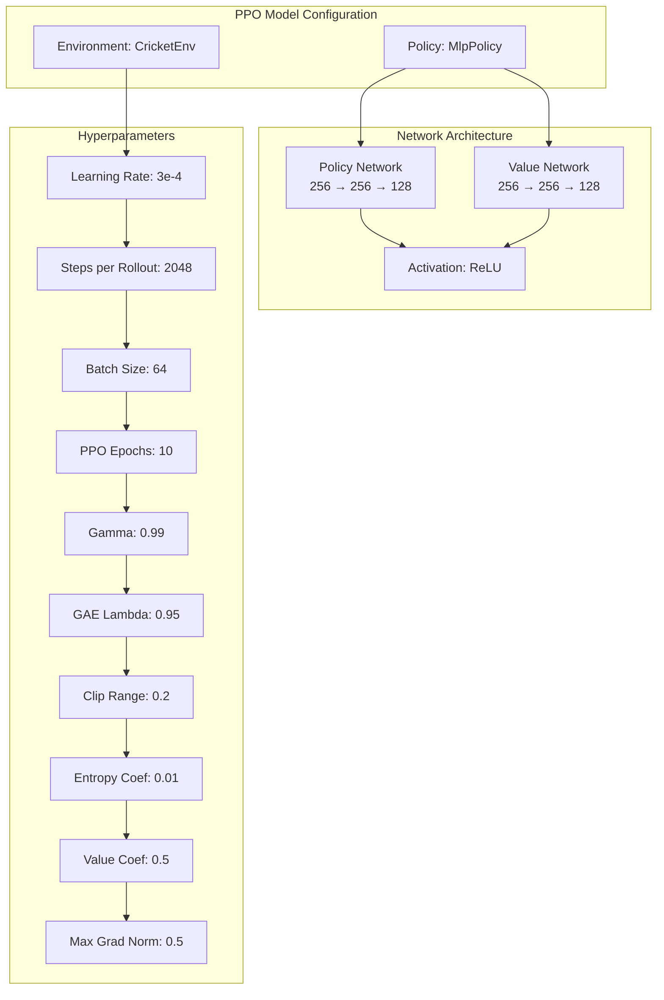
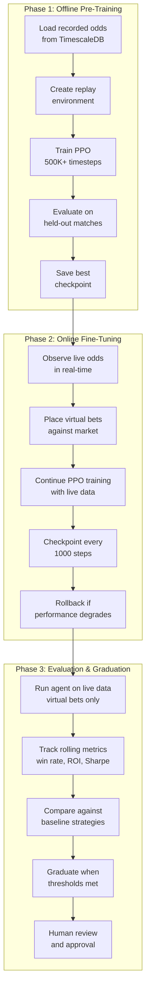
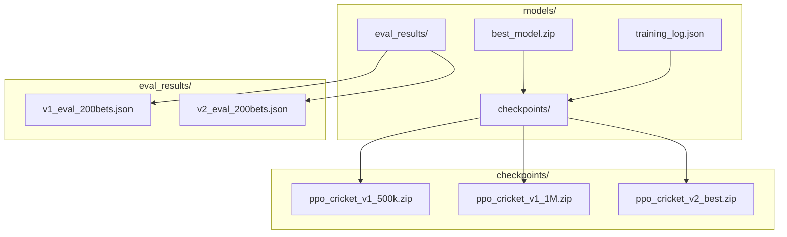

# PHOENIX RL Learning Engine - Detailed Design

## Overview

The RL Learning Engine is the brain of PHOENIX. It replaces hand-coded betting strategies with a self-improving agent that learns from thousands of virtual bets.

---

## 1. Environment Design (Gymnasium)

### State Space (Observation) -- DATA-ONLY PHILOSOPHY

Every feature is raw data from LotusBook/Cricbuzz, a mathematical transformation, or agent portfolio state. NO cricket heuristics.

Expert cricket-trading observation space — every feature is something a professional bettor actually looks at on their screen. No noise, no redundancy.

```
Observation Vector (dim = 48):
├── Group 1: Core Odds (7)
│   ├── back_home, lay_home, back_away, lay_away
│   ├── margin (overround proxy)
│   ├── spread_home, spread_away
│
├── Group 2: Momentum (6) -- math on price series (zeroed on tick gap)
│   ├── odds_velocity_home, odds_velocity_away
│   ├── volatility_home, volatility_away
│   ├── trend_home, trend_away
│
├── Group 3: Market Quality (5) -- spread dynamics
│   ├── spread_dynamics_home, spread_dynamics_away
│   ├── market_efficiency
│   ├── staleness_home, staleness_away
│
├── Group 4: Match State (7) -- derived from LotusBook score_text
│   ├── is_live (0 or 1)
│   ├── overs_normalized
│   ├── wickets_normalized
│   ├── score_normalized
│   ├── run_rate_normalized
│   ├── required_run_rate_normalized
│   ├── innings_normalized
│
├── Group 5: Portfolio (5) -- agent's own state
│   ├── bankroll_pct (current / initial)
│   ├── exposure_pct
│   ├── open_positions_normalized
│   ├── win_rate
│   ├── consecutive_streak (signed, normalized)
│
├── Group 6: Position / Hedge Awareness (4)
│   ├── net_exposure_home_pct
│   ├── net_exposure_away_pct
│   ├── hedge_potential_home
│   ├── hedge_potential_away
│
├── Group 7: Volume / Liquidity (4)
│   ├── volume_depth_home, volume_depth_away
│   ├── volume_imbalance_home, volume_imbalance_away
│
├── Group 8: Bookmaker Behavior (4)
│   ├── pricing_pattern features the agent learns to read
│
├── Group 9: Match Format (4) -- one-hot encoding
│   ├── is_t20i, is_odi, is_test, is_franchise
│
├── Group 10: Timing (2)
│   ├── match_elapsed_pct (fraction of typical match duration)
│   ├── tick_freshness (seconds since last tick, normalized)
```

**Key design principles:**
- ALL match context derived from LotusBook inline (no Cricbuzz dependency)
- Gap detection resets momentum accumulators to prevent stale signals
- Online z-score normalization adapts to changing data distributions
- NaN/Inf/extreme value validation before feeding to agent

### Action Space

```python
class BettingAction(IntEnum):
    HOLD = 0           # Do nothing
    BACK_HOME_SM = 1   # Back home team, small stake (1% bankroll)
    BACK_HOME_LG = 2   # Back home team, large stake (3% bankroll)
    BACK_AWAY_SM = 3   # Back away team, small stake (1% bankroll)
    BACK_AWAY_LG = 4   # Back away team, large stake (3% bankroll)
    LAY_HOME_SM = 5    # Lay home team, small stake (1% bankroll)
    LAY_AWAY_SM = 6    # Lay away team, small stake (1% bankroll)
    LAY_HOME_LG = 7    # Lay home team, large stake (3% bankroll)
    LAY_AWAY_LG = 8    # Lay away team, large stake (3% bankroll)
```

**Design Rationale:**
- HOLD is the default action (most ticks should not trigger bets)
- Separate small/large stakes for position sizing decisions
- Full LAY SM + LG for both teams (enables hedging strategies)
- Hard bet budget per episode (max 10 bets) forces selectivity
- Draw market excluded (lower liquidity on LotusBook)

### Reward Function Design

Capital-safety-first trading reward (see `rl/reward.py`). Core idea: **bet both sides to lock in profit from odds movement; only go directional when highly confident.**

| # | Component | Scale | Trigger | Description |
|---|-----------|-------|---------|-------------|
| 1 | **Hedge Bonus** | 15.0 | Bet reduces exposure & locks profit | BIG reward — #1 thing we want to teach |
| 2 | **Transaction Cost** | -0.02 | Any bet placed | Flat penalty (bookmaker spread is real cost) |
| 3 | **Mark-to-Market** | 1.0 | Every step with open bets | Continuous unrealized P&L delta as odds move |
| 4 | **Settlement P&L** | 10.0 | Bet settles at episode end | Realized outcome — dominant signal |
| 5 | **Capital Safety** | -0.01 | Naked exposure > 3% of bankroll | Penalize large one-sided unhedged positions |
| 6 | **Patience** | +0.01 | HOLD when no edge (low odds change + low CLV) | Meaningful reward for disciplined inaction |
| 7 | **Overtrading** | -0.1 | > 3 bets/hour | Penalty per excess bet |
| 8 | **Exposure Cap** | -0.1 | Total exposure > 50% | Linear penalty on excess |
| 9 | **Drawdown** | -50.0 | Drawdown > 10% | Quadratic penalty |
| 10 | **Sharpe Bonus** | 0.5 | Episode end, ≥ 5 returns | Reward risk-adjusted consistency |
| 11 | **CLV Bonus** | 2.0 | Any step with positive CLV | Reward for beating the closing line |

---

## 2. Agent Architecture

### PPO Configuration



### Why PPO Over Other Algorithms

| Algorithm | Pros | Cons | Verdict |
|-----------|------|------|---------|
| PPO | Stable, good exploration, handles discrete actions | Moderate sample efficiency | **Selected** |
| DQN | Good for discrete, experience replay | Poor for continuous, overestimation | Backup option |
| SAC | Excellent exploration via entropy | Designed for continuous actions | Not suitable |
| A2C | Simple, fast | High variance, unstable | Too risky for financial |

### Training Pipeline



---

### Curriculum Learning Stages

```mermaid
flowchart LR
    subgraph "Stage 1: Basic Pattern Recognition"
        A[Historical data only]
        B[Simplified actions<br/>BACK/HOLD]
        C[Goal: Learn mispriced odds]
        D[Graduation: >52% win rate]
        
        A --> B --> C --> D
    end
    
    subgraph "Stage 2: Full Action Space"
        E[Historical data]
        F[All 9 actions]
        G[Goal: Position sizing & LAY]
        H[Graduation: >5% ROI]
        
        E --> F --> G --> H
    end
    
    subgraph "Stage 3: Live Market Simulation"
        I[Live odds feed]
        J[Virtual execution<br/>with slippage]
        K[Goal: Handle market dynamics]
        L[Graduation: >55% win rate<br/>>8% ROI over 200+ bets]
        
        I --> J --> K --> L
    end
    
    subgraph "Stage 4: Adversarial Testing"
        M[Live market +<br/>adversarial noise]
        N[Goal: Robustness to regime changes]
        O[Graduation: Positive ROI under<br/>adversarial conditions]
        
        M --> N --> O
    end
    
    D --> E
    H --> I
    L --> M
```



---

## 4. Experience Replay and Memory

### Episode Buffer Structure

```python
@dataclass
class Experience:
    observation: np.ndarray    # State at time t
    action: int                # Action taken
    reward: float              # Reward received
    next_observation: np.ndarray  # State at time t+1
    done: bool                 # Episode finished?
    info: Dict                 # Match context, odds, etc.
```

### Prioritized Experience Replay

- High-reward experiences (big wins/losses) replayed more often
- Rare events (wickets, suspensions) upweighted
- Recent experiences weighted higher than old

---

### Model Persistence Structure



### Version Management

- Every model checkpoint saved with training metadata
- A/B testing: new model vs current best on live data
- Automatic rollback if new model underperforms

---

## 6. Monitoring & Debugging

### TensorBoard Metrics

- `rollout/ep_rew_mean` - Average episode reward
- `rollout/ep_len_mean` - Average episode length
- `train/policy_loss` - Policy network loss
- `train/value_loss` - Value network loss
- `train/entropy_loss` - Exploration entropy
- `custom/win_rate` - Betting win rate
- `custom/roi` - Return on investment
- `custom/sharpe_ratio` - Risk-adjusted returns
- `custom/action_distribution` - How often each action is selected
- `custom/hold_percentage` - % of steps with HOLD action

### Key Debugging Signals

1. **Agent always HOLDs:** Entropy too low, increase `ent_coef`
2. **Agent over-trades:** Reward function not penalizing enough, tune overtrading penalty
3. **Win rate high but ROI negative:** Agent winning small, losing big -- tune stake sizing
4. **Training diverges:** Learning rate too high, reduce or add warmup

---

## 7. Graduation System

```python
class GraduationEvaluator:
    """
    Evaluates if RL agent is ready for live trading.
    
    All criteria must be met for 14 consecutive days.
    """
    
    CRITERIA = {
        'win_rate': {'threshold': 0.55, 'window': 200},
        'roi': {'threshold': 0.08, 'window': 200},
        'sharpe_ratio': {'threshold': 1.5, 'window_days': 30},
        'max_drawdown': {'threshold': 0.15, 'window_days': 30},
        'profitable_days': {'threshold': 10, 'window_days': 14},
        'bet_volume': {'threshold': 100, 'window_days': 30},
        'avg_clv': {'threshold': 0.0, 'window': 200},  # Must be positive
    }
    
    def evaluate(self) -> GraduationResult:
        """Check all criteria against rolling windows."""
        results = {}
        all_passed = True
        
        for metric, config in self.CRITERIA.items():
            value = self.compute_metric(metric, config)
            passed = value >= config['threshold']
            results[metric] = {
                'value': value,
                'threshold': config['threshold'],
                'passed': passed,
            }
            if not passed:
                all_passed = False
        
        return GraduationResult(
            ready=all_passed,
            consecutive_days=self.consecutive_pass_days,
            required_days=14,
            metrics=results,
        )
```

### Post-Graduation Protocol

1. **Day 1-3:** Live execution at 25% normal stake
2. **Day 4-7:** Scale to 50% if metrics hold
3. **Day 8-14:** Scale to 75%
4. **Day 15+:** Full stake
5. **Continuous monitoring:** Auto-revert to virtual if metrics degrade
