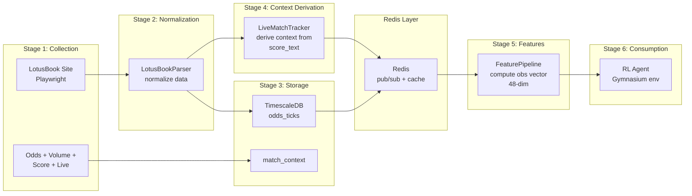
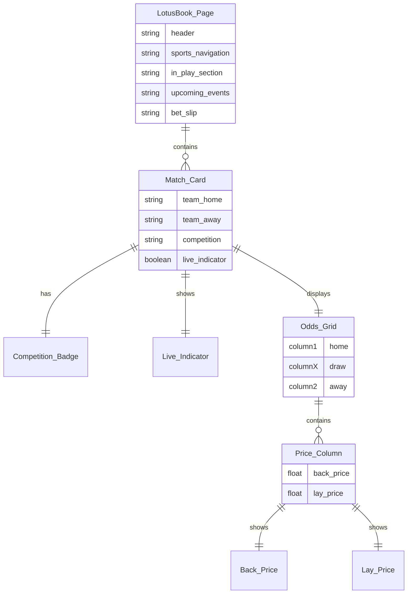
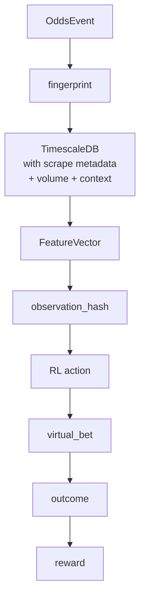

# PHOENIX Data Pipeline Architecture

## Overview

The data pipeline is the foundation of PHOENIX. Every decision the RL agent makes depends on the quality, freshness, and richness of the data flowing through the system.

---

## Pipeline Stages



**Single data source:** All data (odds, volume, score, match context) comes from
LotusBook alone. The `LiveMatchTracker` derives match context (run rate, required
run rate, innings, balls remaining) from the score_text that LotusBook displays.
This eliminates the 7-10 second latency gap that existed with the previous
Cricbuzz enricher approach. CricbuzzEnricher remains as an optional fallback
but is not required.

---

## Stage 1: Collection

### LotusBook Scraper Architecture

```python
class ScraperManager:
    """
    Orchestrates LotusBook scraping.
    
    Responsibilities:
    - Manage Playwright browser instances
    - Coordinate scraper workers per match
    - Handle session/login management
    - Publish events to Redis
    - Write to TimescaleDB
    """

class ScraperWorker:
    """
    Individual match scraper using Playwright + CDP.
    
    Two data extraction modes:
    1. WebSocket interception (preferred - lowest latency)
    2. DOM polling fallback (every 3 seconds)
    """
```

### LotusBook Page Structure



### Normalized Event Schema

```python
@dataclass
class OddsEvent:
    """Normalized event from LotusBook scraper."""
    
    # Identity
    match_id: str              # Unique match identifier
    source: str                # "lotusbook"
    timestamp: datetime        # UTC timestamp
    
    # Teams
    team_home: str             # Home team name
    team_away: str             # Away team name
    competition: str           # Tournament/league name
    
    # Odds (1X2 format)
    back_home: Optional[float]
    lay_home: Optional[float]
    back_draw: Optional[float]
    lay_draw: Optional[float]
    back_away: Optional[float]
    lay_away: Optional[float]
    
    # Volume (liquidity at each price)
    volume_back_home: Optional[float]
    volume_lay_home: Optional[float]
    volume_back_away: Optional[float]
    volume_lay_away: Optional[float]
    
    # Match state
    is_live: bool
    scheduled_time: Optional[datetime]
    score_text: str            # Raw score string, e.g. "45/2 (8.3)"
    
    # Metadata
    scrape_method: str         # "websocket" or "dom"
    scrape_latency_ms: int     # Time to extract data
```

---

## Stage 2: Normalization

### LotusBook Parser

```python
class LotusBookParser:
    """
    Parse raw scraper data into normalized OddsEvent format.
    
    Handles:
    - DOM data (HTML elements → structured data)
    - WebSocket frames (JSON → structured data)
    - Data validation (required fields, valid ranges)
    - Match ID generation and caching
    - Odds format normalization (ensure decimal)
    """
    
    VALID_ODDS_RANGE = (1.01, 1000.0)  # Sanity check
    
    def parse_dom_data(self, raw: Dict) -> List[OddsEvent]: ...
    def parse_websocket_data(self, frame: Dict) -> List[OddsEvent]: ...
    def validate_event(self, event: OddsEvent) -> bool: ...
```

### Validation Rules

1. **Odds must be > 1.0** (decimal format)
2. **Back price <= Lay price** (arbitrage check)
3. **Team names non-empty** and consistent
4. **Timestamp within 5 seconds** of current time
5. **No duplicate events** (fingerprint check)

---

## Stage 3: Storage

### TimescaleDB Schema

```sql
-- Main odds time series table
CREATE TABLE odds_ticks (
    time        TIMESTAMPTZ NOT NULL,
    match_id    TEXT NOT NULL,
    team_home   TEXT NOT NULL,
    team_away   TEXT NOT NULL,
    competition TEXT,
    
    -- 1X2 Odds
    back_home   DOUBLE PRECISION,
    lay_home    DOUBLE PRECISION,
    back_draw   DOUBLE PRECISION,
    lay_draw    DOUBLE PRECISION,
    back_away   DOUBLE PRECISION,
    lay_away    DOUBLE PRECISION,
    
    -- Volume (market liquidity)
    volume_back_home  DOUBLE PRECISION,
    volume_lay_home   DOUBLE PRECISION,
    volume_back_away  DOUBLE PRECISION,
    volume_lay_away   DOUBLE PRECISION,
    
    -- Derived
    implied_prob_home  DOUBLE PRECISION,
    implied_prob_away  DOUBLE PRECISION,
    overround          DOUBLE PRECISION,
    
    -- Live match context (parsed from score_text)
    score       INTEGER,
    wickets     INTEGER,
    overs       DOUBLE PRECISION,
    innings     INTEGER,
    
    -- Match state
    is_live     BOOLEAN DEFAULT FALSE,
    
    -- Metadata
    source              TEXT DEFAULT 'lotusbook',
    scrape_latency_ms   INTEGER,
    
    UNIQUE (time, match_id)
);

-- Convert to hypertable
SELECT create_hypertable('odds_ticks', 'time', chunk_time_interval => INTERVAL '1 hour');

-- Indexes for fast RL queries
CREATE INDEX idx_odds_match_time ON odds_ticks (match_id, time DESC);
CREATE INDEX idx_odds_live ON odds_ticks (is_live, time DESC);

-- Match context from Cricbuzz
CREATE TABLE match_context (
    time        TIMESTAMPTZ NOT NULL,
    match_id    TEXT NOT NULL,
    score       INTEGER,
    wickets     INTEGER,
    overs       DOUBLE PRECISION,
    run_rate    DOUBLE PRECISION,
    req_run_rate DOUBLE PRECISION,
    innings     INTEGER,
    batting_team TEXT,
    bowling_team TEXT,
    last_event  TEXT,  -- 'wicket', 'boundary', 'dot', etc.
    
    UNIQUE (time, match_id)
);

SELECT create_hypertable('match_context', 'time', chunk_time_interval => INTERVAL '1 hour');

-- Virtual bets
CREATE TABLE virtual_bets (
    id          SERIAL PRIMARY KEY,
    placed_at   TIMESTAMPTZ NOT NULL,
    match_id    TEXT NOT NULL,
    action      TEXT NOT NULL,  -- 'BACK_HOME', 'LAY_AWAY', etc.
    team        TEXT NOT NULL,
    odds        DOUBLE PRECISION NOT NULL,
    stake       DOUBLE PRECISION NOT NULL,
    confidence  DOUBLE PRECISION,
    
    -- Settlement
    settled_at  TIMESTAMPTZ,
    outcome     TEXT,  -- 'win', 'loss', 'void'
    profit_loss DOUBLE PRECISION,
    
    -- RL metadata
    agent_version   TEXT,
    observation_hash TEXT,
    reward          DOUBLE PRECISION
);

SELECT create_hypertable('virtual_bets', 'placed_at');

-- RL training metrics
CREATE TABLE training_metrics (
    time            TIMESTAMPTZ NOT NULL,
    episode         INTEGER,
    total_timesteps BIGINT,
    episode_reward  DOUBLE PRECISION,
    episode_length  INTEGER,
    win_rate        DOUBLE PRECISION,
    roi             DOUBLE PRECISION,
    sharpe_ratio    DOUBLE PRECISION,
    max_drawdown    DOUBLE PRECISION,
    policy_loss     DOUBLE PRECISION,
    value_loss      DOUBLE PRECISION,
    entropy         DOUBLE PRECISION,
    agent_version   TEXT
);

SELECT create_hypertable('training_metrics', 'time');

-- Graduation tracking
CREATE TABLE graduation_snapshots (
    time                TIMESTAMPTZ NOT NULL,
    win_rate            DOUBLE PRECISION,
    roi                 DOUBLE PRECISION,
    sharpe_ratio        DOUBLE PRECISION,
    max_drawdown        DOUBLE PRECISION,
    profitable_days     INTEGER,
    total_bets          INTEGER,
    all_criteria_met    BOOLEAN,
    consecutive_days    INTEGER
);

SELECT create_hypertable('graduation_snapshots', 'time');

-- Data retention policies
SELECT add_retention_policy('odds_ticks', INTERVAL '90 days');
SELECT add_compression_policy('odds_ticks', INTERVAL '7 days');
```

### Redis Channels & Keys

```
# Pub/Sub Channels
match_events        → Real-time odds from scraper
match_context       → Cricket stats from LiveMatchTracker (derived from LotusBook)
rl_actions          → Agent decisions
virtual_outcomes    → Bet settlements
training_progress   → Training metrics for dashboard

# Key-Value
active_matches              → JSON list of live matches
agent:state                 → Current agent mode (training/eval/live)
agent:version               → Current model version
feature_cache:{match_id}    → Cached feature vector
graduation:status           → Current graduation progress
graduation:history          → Last 30 days of snapshots
```

---

## Stage 4: Context Derivation (LiveMatchTracker)

### Unified Single-Source Architecture

All match context is now derived inline from LotusBook data — no external API needed.

```python
class LiveMatchTracker:
    """
    Derives MatchContext from LotusBook OddsEvent data every tick.
    
    Replaces CricbuzzEnricher — zero latency gap between odds and context.
    
    Per-tick derivation:
    - score, wickets, overs  → parsed from score_text (e.g. "45/2 (8.3)")
    - run_rate               → calculated: score / overs
    - required_run_rate      → 2nd innings: (target - score) / overs_remaining
    - innings                → detected via score reset (156/5 → 5/0)
    - balls_remaining        → max_balls - overs_to_balls(overs)
    - match_format           → inferred from competition name via MatchCategoryClassifier
    """
```

### Why Not Cricbuzz?

| Issue | Impact |
|-------|--------|
| 10-second poll interval vs 3s LotusBook | 7s latency gap during high-volatility events |
| Undocumented API | Can break without notice |
| Fuzzy match ID mapping | Fails for lesser-known teams |
| Separate HTTP requests | Extra network dependency |

LotusBook already displays live scores on its cricket page. The `LiveMatchTracker`
parses this data inline with each scraper tick, delivering match context with the
same freshness as odds data.

### CricbuzzEnricher (Optional Fallback)

`scraper/enricher.py` remains in the codebase as an optional fallback for cases
where LotusBook's score_text is unavailable or incomplete. It is **not started
by default** — the LiveMatchTracker handles all context derivation.

---

## Stage 5: Feature Computation

### Feature Pipeline

```python
class FeaturePipeline:
    """
    Computes RL observation vector from raw data. DATA-ONLY approach.
    
    Input: match_id + OddsEvent + MatchContext + PortfolioState + position_state
    Output: np.ndarray of shape (48,)
    
    Feature groups (48 total, expert trading set):
    1. Core Odds (7) -- prices, margin, spreads
    2. Momentum (6) -- velocity, volatility, trend (zeroed on gap)
    3. Market Quality (5) -- spread dynamics, efficiency, staleness
    4. Match State (7) -- is_live, overs, wickets, score, run_rate, innings
    5. Portfolio (5) -- bankroll, exposure, positions, win rate, streak
    6. Position (4) -- net exposure, hedge potential
    7. Volume (4) -- liquidity depth, imbalance
    8. Bookmaker (4) -- pricing patterns
    9. Format (4) -- T20i / ODI / Test / Franchise one-hot
    10. Timing (2) -- match elapsed %, tick freshness
    """
    
    def compute(self, match_id: str, event: OddsEvent, 
                context: Optional[MatchContext] = None,
                portfolio: Optional[PortfolioState] = None,
                position_state: Optional[dict] = None) -> np.ndarray:
        
        features = []
        history = self._get_recent_history(match_id)  # lookback=120s
        
        features.extend(compute_odds_features(event))            # 7
        features.extend(compute_momentum_features(history))      # 6
        features.extend(compute_market_features(event, history)) # 5
        features.extend(compute_match_stats_features(context))   # 7
        features.extend(compute_portfolio_features(portfolio))   # 5
        features.extend(compute_position_features(position_state))  # 4
        features.extend(compute_volume_features(event, history)) # 4
        features.extend(compute_bookmaker_pattern_features(...))  # 4
        features.extend(compute_category_features(category))     # 4
        features.extend(self._compute_timing(event, ...))        # 2
        
        obs = np.array(features, dtype=np.float64)
        obs = self.normalizer.update_and_transform(obs)
        return obs.astype(np.float32)  # shape (48,)
```

### Feature Normalization

- Online z-score normalization (running mean/std, no look-ahead bias)
- NaN/Inf/extreme value clamping before normalization
- Gap detection (>30s between ticks) resets momentum accumulators
- `validate_observation()` rejects invalid vectors (returns zeros)
- Normalizer state persisted and reloaded across restarts

---

## Stage 6: Consumption

### RL Agent Consumption

The RL agent receives observations and returns actions:

```python
# In the training loop
obs = feature_pipeline.compute(match_id, event, context, portfolio)
action, _ = agent.predict(obs, deterministic=False)  # Stochastic during training

# In evaluation/live
action, _ = agent.predict(obs, deterministic=True)   # Deterministic in production
```

### Dashboard Consumption

The frontend receives data via:
1. **WebSocket** - Real-time odds, signals, training progress
2. **REST API** - Historical data, analytics, graduation status
3. **Redis subscription** - Agent state changes

---

## Data Quality Monitoring

### Ingestion Quality Gates (3-tier)

Applied in `ScraperManager._on_events()` before DB storage:

| Gate | Rule | Action |
|------|------|--------|
| Gate 1 | Odds > 500 (no real market) | Reject tick |
| Gate 2 | Both teams < 1.02 (impossible market) | Reject tick |
| Gate 3 | TickValidator checks (spread inversion, range, jumps, duplicates) | Reject on error, log on warning |

### Episode Quality Gate (pre-training)

Applied via `EpisodeQualityGate` before RL training consumes a match:

| Check | Weight | Threshold |
|-------|--------|-----------|
| Completeness (both back prices) | 40% | >= 40% |
| Odds jumps (> 50% change) | 20% | < 20% of ticks |
| Duplicate timestamps | 15% | < 30% |
| Missing odds | 15% | < 50% |
| Overround violations | 5% | < 10% |
| Context violations | 5% | < 10% |

Episodes with composite score < 0.50 are rejected from training.

### Manual Data Validation

Endpoint: `GET /api/matches/{match_id}/validate`

Returns detailed quality metrics + recommendation (approve/review/reject):
- Quality score, completeness, odds jumps, duplicates
- Live vs pre-match tick counts, duration
- Odds range summary, missing lay prices
- Volume and score data coverage

The approve endpoint (`PATCH /api/matches/{id}/approve`) runs validation
automatically and blocks if quality < 0.50 (override with `?skip_validation=true`).

### Metrics to Track

| Metric | Threshold | Alert |
|--------|-----------|-------|
| Scraper uptime | > 99% during matches | Scraper down > 30s |
| Data freshness | < 5 seconds | Stale data > 10s |
| Parse success rate | > 95% | Error rate > 10% |
| Feature completeness | 100% required fields | Missing critical field |
| Odds range validity | 1.01 - 1000.0 | Out of range |
| Enrichment match rate | > 80% | Low match rate |
| Volume data coverage | > 50% of ticks | Volume missing |
| Score context coverage | > 0% of live ticks | Score parsing failed |

### Data Lineage


